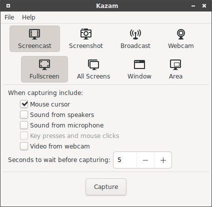
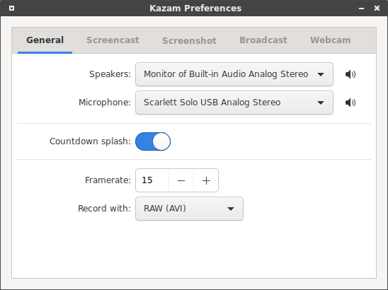

           Kazam v1.5.5 "Bugfix"

# Introduction

Kazam is a simple screen recording program that will capture the content
of your screen and record a video file that can be played by any video
player that supports VP8/WebM video format.

Optionally you can record sound from any sound input device that is
supported and visible by PulseAudio.

I found the launchpad site update is super slow, so I made this one with many bugs fixed. It is working for me in my Ubuntu 19.04 box.

# Latest version

Kazam is always available from Launchpad under https://launchpad.net/kazam

Latest stable release is 1.4.4.
Latest unstable release is 1.5.5

Installation - stable release
-----------------------------

If you are using Ubuntu 14.04 then stable version (1.4.4) is available from
universe repository. You can find it in Ubuntu Softare Center or install it
from the terminal with the following command:

$ sudo apt-get install kazam

For other Ubuntu based distributions the best way to install Kazam is
to add a PPA repository and then use apt-get command or Software Center.

$ sudo add-apt-repository ppa:kazam-team/stable-series
$ sudo apt-get update
$ sudo apt-get install kazam

For distribution independent installation you will have to get the latest
tarball release from Launchpad:

http://launchpad.net/kazam/stable/1.4.4/+download/kazam_1.4.4.tar.gz

Unpack it and then run setup:

   $ tar -xzf kazam_1.4.4.tar.gz
   $ cd kazam-1.4.4

Run installation as root user, or use sudo:

   # python3 setup.py install

Installation - unstable version
-------------------------------

Installing current unstable build from a PPA can be done by adding
unstable series PPA.

$ sudo add-apt-repository ppa:kazam-team/unstable-series
$ sudo apt-get update
$ sudo apt-get install kazam

Installation - development version
----------------------------------

If you want bleeding edge, development version then you will have to get
source code from Launchpad by running the following command:

   $ bzr branch lp:kazam/unstable

Then you need to run setup.py to build and install Kazam:

   $ cd kazam
   # python3 setup.py install

You will have to run setup as root user or use sudo. Default installation
path is /usr/local.

Running Kazam
-------------

If you want to run Kazam from the source tree, there are a few limitations
that you have to take into account. Every icon has to be taken from
currently installed icon theme. Toolbars will not show any icons and you
will not see Unity AppIndicator.

To run Kazam simply execute te following commands in the source tree:

$ cd bin
$ ./kazam

If you already have Kazam installed then Kazam icons will be displayed
properly.

Keyboard shortcuts
------------------

SUPER-CTRL-Q - Quit
SUPER-CTRL-W - Show/Hide main window
SUPER-CTRL-R - Start Recording
SUPER-CTRL-F - Finish Recording

Keyboard shortcuts will work on Precise Pangolin only if you installed
Kazam 1.4.x from the PPA, keybinder 3.0 is a dependency and will be installed
automatically.

For Ubuntu 12.10 and newer keyboard binder is available in the universe
repositories and there is no need to use PPA to get keybinder installed.

Recording Tips
--------------

Framerates above 20fps are unlikely to work well because of software and
hardware limitations. If you increase framerate and framerate in
resulting video drops, that is because encoder can't keep up.

Always do a sound check. Especially if you are recording a live commentary
with background sound. I got the best results when I used earphones to listen
to the audio while recording. This way your mic will not pick up any audio
coming from speakers.

If you _really_ want loss-less quality, then you will have to record in RAW
format. This is possible, but without an SSD with a lot of free space your
results will be terrible. 1920x1080 at 15 frames per second will need
around 45 MB of disk space per second. Most people will want to record at
20 or 25 frames per second. Most disk will not handle that and your
system will start to crawl.

Your next best bet is HUFFYUV format, which is a little bit friendlier on
disk bandwidth with 28 MB per second at 15 frames per second. The problem?
Not many video editors and players can handle HUFFYUV, let alone video
sharing services.

Known Issues
------------

- New countdown timer will work correctly only if you have pycairo 1.10.1
installed. Ubuntu 14.04 ships with 1.10.0. Unstable PPA for kazam currently
provides the latest pycairo. This version of pycairo is untested and it might
happen that other things will break if you install it.

- Trouble with recording audio from certain Monitor sources. I noticed
this with Logitech G110 USB Keyboard that can play audio. Pulse
Audio will see two devices: USP PnP Stereo Device and 'Monitor of USB PnP
Stereo Device'. When recording from the monitor, volume controls for
both devices will affect the volume in the final recording.

- I have no idea where to put Mute/Unmute button, so right now every audio
source you select is automatically unmuted.

- It was reported that sound is disappearing after couple of minutes into
the recording. I wasn't able to reproduce this bug and any more info is
appreciated. See https://bugs.launchpad.net/kazam/+bug/933835 for more
details.

- Two memory leaks were noticed, one with VP8 encoder and one with Intel
graphics cards. Still investigating if this is a driver, Xorg or
GStreamer problem.

- Non compositing window managers are not able to render transparent
windows. Area selection and countdown timers will be affected by this.
Mint users can turn on window compositing in Desktop Settings.

- When taking a screenshot of a preselected window with window decorations
you have to make sure that your window is not covered by other windows.

- Mouse cursor is offseted by a number of pixels when capturing video of a
pre-selected window. This is due to a GStreamer bug.
See https://bugs.launchpad.net/kazam/+bug/1092339 and
https://bugzilla.gnome.org/show_bug.cgi?id=690646 for more info.

- Preliminary support for displaying keypresses and mouse clicks is done.
It looks ugly and support is still clumsy it can also die and stop working.
There are issues with dual screen setups.

- Broadcast support is currenly in a very experimental stage. It will only
work for YouTube Live. Support for Twitch is coming in the next updates.
You will have to provide YouTube Live Stream and Server URL from custom made
ingestion.

Debugging & reporting problems
------------------------------

If you encounter a bug or any kind of unexpected behavior please try to
reproduce it while you run Kazam from standard terminal with --debug option.
Use Launchpad to report bugs (https://bugs.launchpad.net/kazam/+filebug) and
include generated output.

